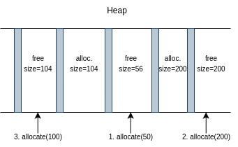

# My malloc/free

Description:

Codebase is the exact same as with main branch. Implicit free list. However, in the `allocate` function the search algorithm is not first fit but best fit.

Best fit algorithm searches from the start every time `allocate` is called. Best fit algorithm is used if we care about space efficiency. It always finds the smallest available block on the heap to allocate. For example, if we have three blocks in this order:
- B1:free 104 bytes
- B2:allocated 104 bytes
- B3:free 56 bytes
- B4:allocated 200 bytes
- B5:free 200 bytes

and an `allocate(50)` call is made, best fit would scan the whole heap and find that block B3 is the most suitable one to allocate. First fit would allocate B1. Undestandably, best fit is not time efficient but rather space efficient. This is shown in the picture as well:

This implementation supports splitting blocks and coalescing. However, it does not support footers/boundary tags. If we want to coalesce with the previous block, we call `search_prev_header` function (O(n) time complexity - slow!).

