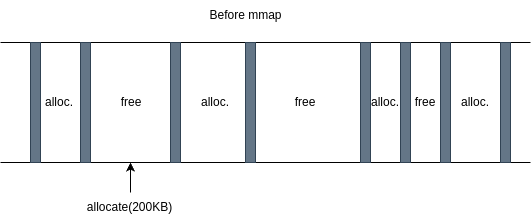
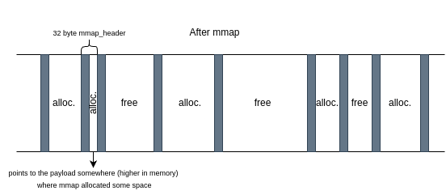

# My malloc/free

### Description - Hybrid mmap/sbrk w/ first fit implementation

Same codebase as the main branch aka implicit free list. In this branch we implement a hybrid version which uses `sbrk` and `mmap` functions.

Function `allocate(size)` is called.

If `size > 128KB` then allocate with `mmap`.

Else allocate with `sbrk`.

## Keeping track of mmap'd pointers

In this implementation we can have both allocations done with the typical sbrk syscall, and mmap. How to separate when freeing?

For sbrk pointers, we do everything the same way as before. An implicit list.

For mmap, we introduce a new header, the `struct mmap_header` which includes two extra fields

```c
struct mmap_header {
    size_t size;
    struct header* next;
    void* mmap_ptr;
    size_t ptr_size;
};
```

the pointer that mmap returns (*mmap_ptr*), and the size allocated(*ptr_size*). When allocating with mmap, the `allocate` function will store an `mmap_header` metadata block in the heap with the exact size of 32 bytes (*sizeof(struct mmap_header)*).

Also, due to 8-byte alignment, the 3rd LSB of the `size` field will always be 0. Conventionally, we name this bit *is_mmap'd*. If it is 0, we interpret it as **not mmap'd** bit, while 1 means **mmap'd**. We do that to distinguish normal headers from mmap_headers.

That way, when wanting to free an mmap'd pointer, we traverse the heap.

- If the *is_mmap'd* bit is 1 and the mmap_ptr field equals the pointer we are requesting to free, then call `munmap`
    - Continue with coalescing etc
- If the bit is 0, do not `munmap`, free as known





### Tradeoff

1. By this solution we introduce external fragmentation of the order of 32 bytes. If we have mulitple big allocations (>128KB), we have to store many small headers. When we later free them, the heap will end up containing small free blocks here and there (but they may be coalesced).

2. Linear time to find if a pointer was mmap'd

3. Time penalty - mmap is slower than sbrk

4. Benefit for the heap - do not fill the heap with big allocations, keep it simple and quick for smaller ones