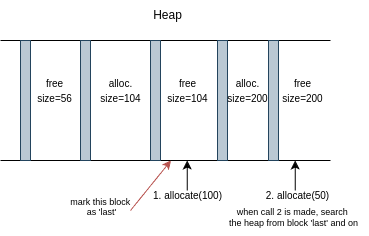

# My malloc/free

## Description - Implicit List w/ Next Fit

Codebase is the exact same as with main branch. Implicit free list. However, in the `allocate` function the search algorithm is not first fit but next fit.

Next fit algorithm does not search from the start every time `allocate` is called. It picks up from where it left off last time. This can (probabilistically) be a lot faster than first fit, or in the worst case, same as first fit. In this implementation, if next fit fails to find a suitable free block from where it left off, until the end of the heap, it searches from the beginning of the heap (until where it left off). This means, that the worst case scenario is the same as first fit.

This implementation supports splitting blocks and coalescing, all same as main branch.

The only tests that change here is that instead of first fit we test next fit algorithm.