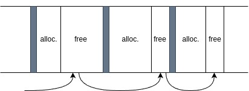

# My malloc/free

## Description - Explicit Free List (LIFO) w/ First Fit

Codebase is now slightly different from main branch. 

In this branch we have an explicit free list implementation. Instead of having our heap as one huge linked list and parse all of it whenever, we only parse the free blocks (there is not really a reason to parse allocated blocks). Instead of parsing #blocks, we parse #free_blocks. This can significantly decrease search times (still linear, but a huge optimization over implicit lists). 

This is a FIFO explicit free list. Each time a new block is freed, it is placed at the start of the list.

- Alternatives: address ordered list -> order free blocks by their memory addresses

Still, right now first fit is used (quick, but not memory optimal at all).

- Alternatives: next-fit or best-fit algorithm (best-fit is the memory-optimal solution).

**Splitting** is done to improve the aforementioned problem (need to spend a bit of time splitting..!).



We create a pseudoblock which is called the *root* of free blocks. It has a size of 0, its *prev* block is set to NULL, and only points forward to the next free block. Iterations start from this block. 


### Other strategy

Treat this problem as a data structure problem. Could implement the whole header structure as a tree, e.g.:

```C
struct free_blk_header {
    size_t size;
    struct free_blk_header *parent;
    struct free_blk_header *left;
    struct free_blk_header *right;
}
```

Trees have lower time complexity (O(logn)) in comparison to linked lists (O(n)).

## Note
Coalesce is not supported yet. Also, not all edge cases are supported when freeing (its a bit buggy!).
