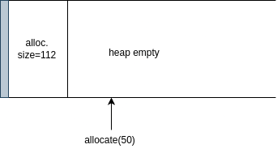

# My malloc/free

## Baseline implementation

**Description**:

Implementation of my own `allocate` and `free` functions for C. Uses ``sbrk`` function. Current implementation uses implicit list and first fit algorithm. It is more of a general purpose allocator. 

The main.c file is just for testing the API. The library itself is in the src/memman folder (short for memory manager).

**API:**
| Function | Description | Returns |
|----------|-------------|---------|
| allocate(size_t size) | allocates <i>size</i> bytes in the heap | returns a void* pointer to an address on the heap, or NULL if operation fails |
| free(void* ptr) | frees up the memory from a specified pointer | does not return anything |

## Run

Compile the library using the `make` command. The Makefile generates a .so file under the build/ directory to link the library to your own program (#include "memman.h"). There is also a `main.c` file which is for testing the allocator.

The script `run.sh` does everything for you, compiles and runs the program you wrote.

## Implementation specifics


The job of a memory allocator is to ask for some memory, and get a pointer in return, which points to an address on the heap.

Since we cannot just randomly ask for spare space in the heap, we need to somehow keep track of what is allocated and what is free. This is done using a linked list of metadata headers, with the struct shown below. 
We use the term `block` to describe some space in the heap.


```C
struct header {
    size_t size;
    struct header* next;
};
```

Block = Header + User Data.

That way, we can represent our heap as a linked list, traverse it, and locate free or allocated blocks.

## Allocate

When we call allocate(size), `sbrk` is called under the hood. 
This function first places a header on the heap, and then binds *size* bytes extra after the heap. Meaning that, sbrk 
is called as `sbrk(size + sizeof(struct header))`. Allocating size for the header indeed introduces some memory overhead, but is
essential for managing the heap.

Memory alignment is an important feature embedded. We implement 8 byte alignment. All `struct header` pointers start at an address divisible by 8, and all sizes requested are aligned to the next nearest multiple of 8 (e.g., 7 becomes 8, 10 becomes 16 etc). That means that the payload of a block (the actual data) are padded up to the next multiple of 8 (causes a little bit of internal fragmentation).




The grey box denotes the header of the block. If we zoomed in the header it would look like this: 


**Search algorithm**

We need an algorithm to search and allocate blocks. In this branch, we do it using first fit.
- Alternatives: next fit & best fit (see branches implicit/next-fit and implicit/best-fit)

In first fit algorithm, we traverse the headers one by one. If header says block is free, and has enough size, then allocate this block.

**How to know if a block is free**

Since we require alignment of 8 bytes (aka addresses are a multiple of 8), this implies that the 3 LSBs of the `size` variable are all 0 (e.g., 8 is 0000 1000, 88 is 0101 1000). Conventionally, we label the LSB of the size variable as 'is_free'. If 0, block is allocated, else it is free.

In C it would look like the following: 

```c
header.size = header.size | 1  //bitwise OR to mark LSB 1
header.size = header.size & ~1 // bitwise AND to mark LSB 0
```


**Splitting**

If there already exists a free block in the heap, and is bigger than the size we request (e.g., free block is 500 bytes and we ask for 50), then we split the block in two. One for the 50 bytes + sizeof(header), and the remainding is a new free block (consider the header size too).

*Small optimization*: if no more than `SPLIT_TOL%` of the total block is left free after splitting, consider it not worth to spend the time splitting, and just allocate the whole block (saves time, introduces internal fragmentation). 


## Free

Suppose we already have some allocated blocks in our heap because we called `allocate` in our program: 
```C
void somefunc(void) {
    ...
    void* p2 = allocate(50);
    ...
    free(p2);
}
```


All we have to do is move the pointer `sizeof(header)` bytes back, and mark the area as `free`. Even though data already exists inside that block, it is marked as free, and thus **reusable**.
It is important to understand that the data is not NULL-ed, we just wait for another pointer to overwrite that area (use-after-free and other vulnerabilities arise).

**Coalescing** 

If the adjacent blocks of the block being freed are also free, then coalesce them. Stricly, just coalesce the neighbouring blocks, only when a `free` call has been made.

- Alternative: deferred coalesceing -> while searching for a block to allocate, coalesce whenever possible on the way.

Benefits: reduce external fragmentation since (up to three) free blocks form one bigger one. 


**Footer / Boundary Tag**

Problem: when freeing a block, we need to check if we can coalesce with the preceding block. Conceptually, the current block, knows who is the next block (via header.next), but knows nothing about the preceding. So, how to know whether to coalesce? 
- Options: doubly link list, search from start, boundary tag

Doubly linked list is a time efficient solution but costs one more field in the `struct header` (e.g., a struct header* prev field). Search from start is simple to implement but is slow.

The last solution is intuitive. Whenever we free a block, at the end of it (right before the start of the next block), we place a footer, which contains the address of the freed block.


The orange line in the free block is the footer. Now, If I want to free p3: 
1. I know that what to do with p3.next 
2. If I go back sizeof(header)-sizeof(footer) bytes from p3, then I now point to the footer. 

The footer struct contains only one variable which is the address of its header. The pointer is casted to (struct footer*) and we easily reference the previous header.

```C
struct footer {
    header_t* header;
};
```

But do I always look for the footer? What is the previous block is allocated? In this case, the footer 'does not exist', it contains actual data being used. Due to alignment, just like the LSB marked 'is_free', the 2nd LSB is used to denote whether the previous block is free. When freeing a header, we `place_footer(header)` and `set_prev_allocation_status_free(header->next)`. The last function, sets the 2nd LSB of header.next, so that when we want to free header.next, we can check this specific bit. If set, we search for the footer and coalesce.

Summary of the `size` field of the header struct:


Benefit: constant time to coalesce with preceding block.

## Further research

There is a lot of research done on memory allocators. We point out some advanced implementations, other than a simple implicit free list with first fit:

- Explicit free list: see branch explicit/first-fit for that.
- Segragated free lists
- Buddy systems
- Slab allocators
- Layered architecture allocators
- Hybrid allocators

Advanced concepts to consider when building a memory allocator: 
- Deferred coalescing
- Program patterns (ramp, peak, plateau)
- How much fragmentation to tolerate
- Memory arenas (thread safety plus speed)

## Resources

1. [Computer Systems A Programmer's Perspective](https://www.cs.sfu.ca/~ashriram/Courses/CS295/assets/books/CSAPP_2016.pdf)
2. [IIT - Implementing Malloc](https://moss.cs.iit.edu/cs351/slides/slides-malloc.pdf)
3. [UWaterloo - Dynamic Memory Allocation](https://rcs.uwaterloo.ca/~ali/cs350-f19/allocation.pdf)
4. [Carnegie Mellon University Lectures (19 & 20)](https://scs.hosted.panopto.com/Panopto/Pages/Sessions/List.aspx)
5. [Composing High-Performance Memory Allocators](https://people.cs.umass.edu/~emery/pubs/berger-pldi2001.pdf)
6. [LLFREE: Scalable and Optionally-Persistent Page-Frame Allocation](https://www.usenix.org/system/files/atc23-wrenger.pdf)